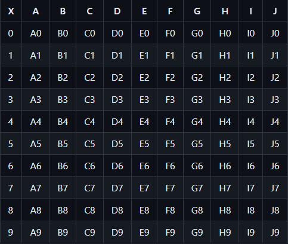

# Manual
* ## Que es el juego?:
  * Cada partida se enfrentan dos **Comandantes**, los cuales son **programados** por los _jugadores_. 
  * Los **Comandantes** deben dirigir las tropas de su tablero (10x10) y atacar el tablero rival y destruir todas sus tropas. 
  * Al inicio de un enfrentamiento los **Comandantes** deberan montar su tablero y despues por turnos, como en el ajedrez, se enfrentaran dandole ordenes a sus tropas.

  * Gana el **Comandante** que destruya todas las tropas enemigas

* ## Como funciona el juego?
  * Al iniciar un enfrentamiento los **Comandantes** deben posicionar sus tropas en su tablero. 
  * Un **Comandante** solo puede hacer una jugada cada turno, para tomar esa decision recibe un informe que contiene informacion de la jugada del rival y los resultados de su jugada anterior. 
  * En cada **jugada** el comandante puede escoger una tropa que realice una accion, atacar o moverse.
  * Tu **Comandante** debe destruir todas las tropas enemigas para ganar.

* ## El Tablero:
  * Tu tablero es de 10x10 unidades, la columna **A** es tu retaguardia y la Columna **J** es tu frente.
  
  


* ## Las Tropas:
* Las tropas son robots con mente propia! aunque el comandante decide la jugada las tropas pueden decidir donde atacar y moverse y contarle al comandante que haran para que el comandante mande la jugada.

* **baseTroop:**

  * Es el programa basico de todas las tropas, las tropas pueden usar su programacion base usando el comando 
  ```python3 
  super().mover()
  o
  super().atacar()
  ```
  * Tambien le entrega a las tropas su atributo id 
  * ```python3
    self.id

* **soldado (soldier.py)**
  * Unidad más sencilla 
  * **Se mueve:** Una casilla a su alrededor.
  * **Ataca:** La casilla enemiga seleccionada.
  * **Unidades disponibles:** 5.

* **Scout (scout.py)**
  * Puede revelar las tropas enemigas.
  * **Se mueve:** Una casilla a su alrededor.
  * **Ataca:** La casilla enemiga seleccionada y detecta las casillas a su alrededor, lo descubierto por el **Scout** se ve reflejado en el informe que recibas tu proximo turno.
  * **Unidades disponibles:** 2.

* **Cañon Gauss (gauss.py)**
  * Capaz de destruir una fila en solo un ataque.
  * **Se mueve:** Una casilla en vertical, se mueve solo a lo largo de la columna.
  * **Ataca:** Selecciona una casilla en la misma fila en la que se encuentra el **Cañon Gauss**, destruye toda las tropas en la fila enemiga.
  * **Unidades disponibles:** 2.

* **Granadero (himars.py)**
  * Adora las granadas de racimo.
  * **Se mueve:** Una casilla a su alrededor.
  * **Ataca:** Una casilla enemiga y otras 4 alrededor de manera aleatoria.
  * **Unidades disponibles:** 3.

* **Torre AA (tower.py)**
  * Brinda apoyo aereo a la batalla.
  * **Se mueve:** No puede moverse.
  * **Ataca:** Ataca una casilla enemiga y otras 4 aleatorias la columna de la casilla atacada.
  * **Unidades disponibles:** 1.
* ## Que debo implementar?
  * Tu **Comandante** debe tener de manera obligatoria los metodos ```montar_tropas()``` y  ```jugar_turno()```.
  * #### montar_tropas()
    * Debe retornar una lista de listas las cuales contienen el id, tipoTropa y posicion
    * ```python 
      [
      ...
      [id, tipoTropa, posicion],
      ...
      ]
      # Las tropas tienen el atributo id por BaseTroop
    
  * #### jugar_turno()
    * #### Informe e InformeEnemigo
      * Al metodo se le entrega informes como argumento, los cuales tiene informacion de la partida.
      * El informe tiene la siguiente estructura:
      * ```python
        {"ataque": [casillasAtacadas_por_ti],
        "detectados": [pos_De_tropas_enemigas_detectadas],
        "bajas": [ids_de_tus_tropas_destruidas],
        "mov_exitoso": Bool # True si la jugada anterior es valida, False si no
        }
      * El informeEnemigo tiene la siguiente estructura:
      * ```python
        {"ataque": [casillasAtacadas_por_Enemigo],
        "detectados": [id_De_Tus_Tropas_Detectadas],
        "bajas": [tipo_de_tropas_enemigas_destruidas]
        }
    * #### Retornar
      * Debes retornar una lista con: 
        * **id** de la tropa que jugaras en el turno.
        * Que **accion** ```"mover"``` o ```"atacar"``` realizara.
        * A que **casilla** se mueve o ataca la tropa.
        * ```python
          [id, accion, casilla]
      